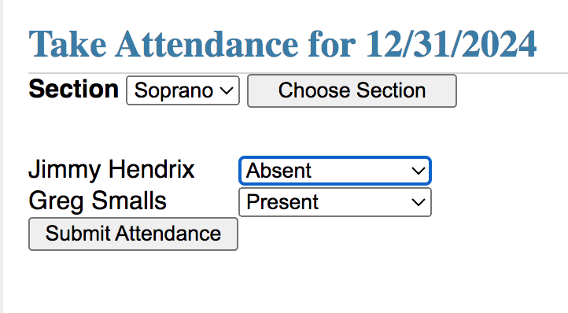
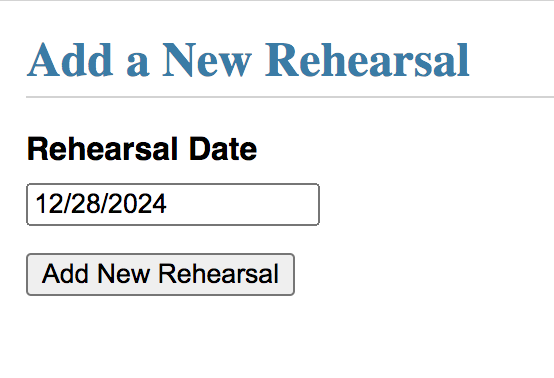
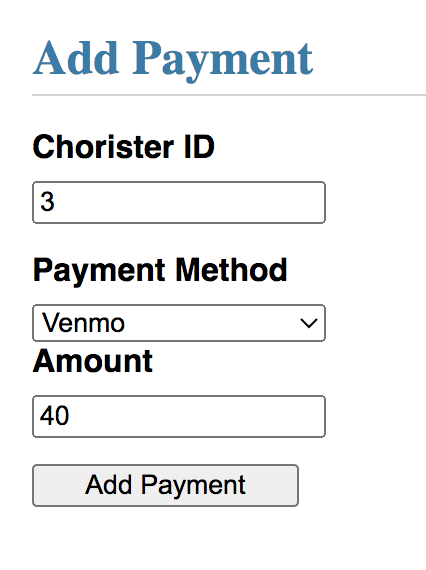
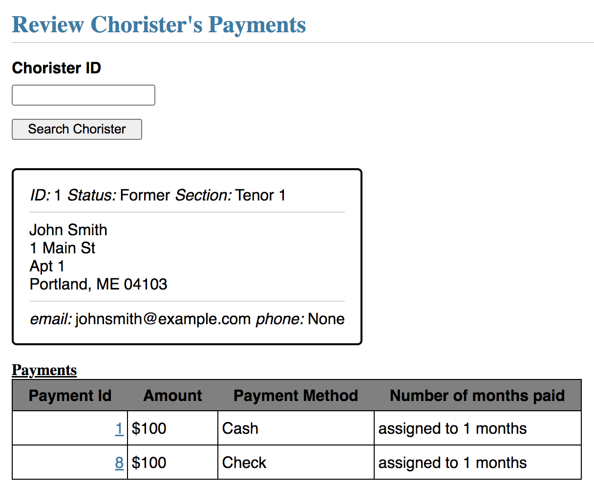
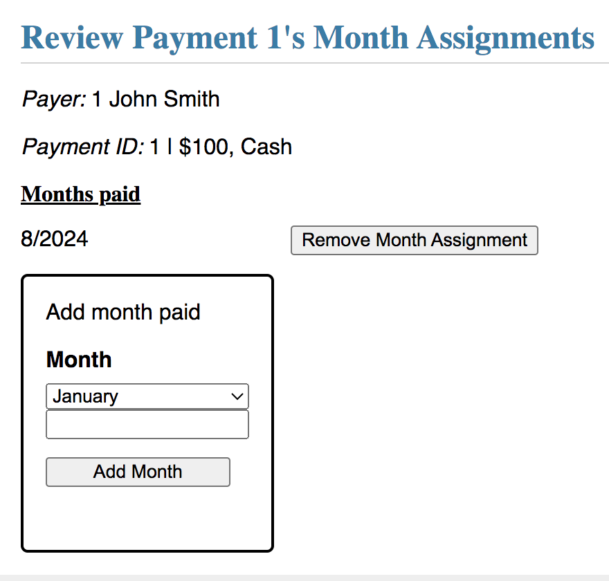
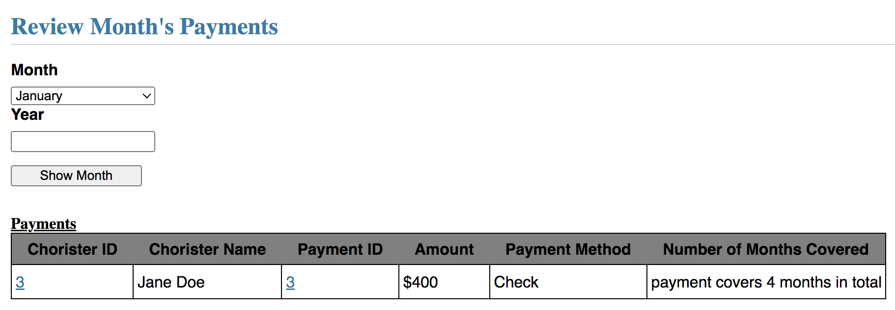
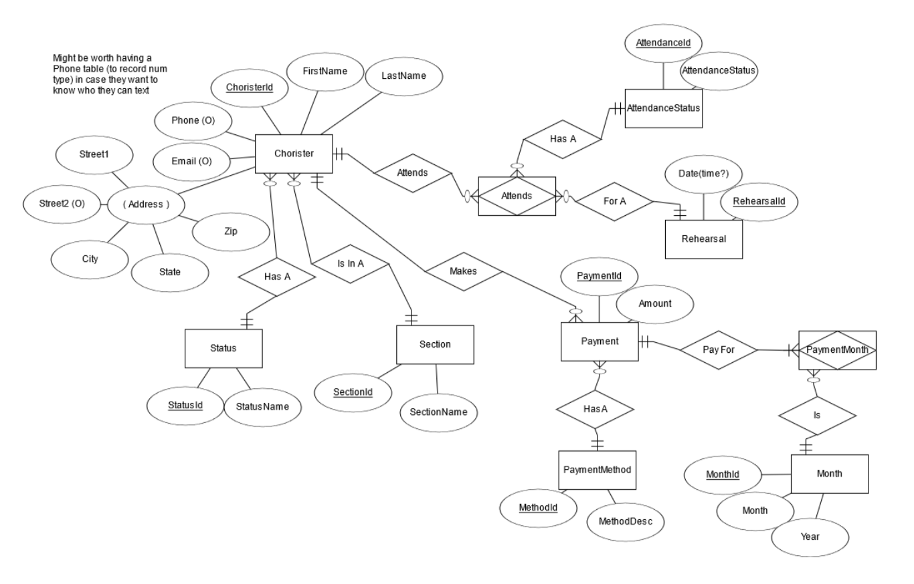

# ChoristerDB

## Getting Started
Start by creating a folder and following the directions at <https://flask.palletsprojects.com/en/stable/installation/>.  Download the repo into the folder that you set up.

Then, initialize the database:

```flask --app chorister_db init-db```

Now, you'll be able to run the app:

```flask --app chorister_db run --debug```

Navigate to 127.0.0.1/auth/login and use the username "admin" and the password "password"

This takes you to a homepage, with different sections of links, depending on your permissions. Note that at any point, you can click "ChoristerDB" at the top of the page to navigate back to the homepage.

## Reset Password
All users will have access to reset their own passwords at all times.  This is because every user is created in the "Database Administration" section, as described below, and given a password by the administrator that created them.  Clicking on the "Reset Password" link takes the user to a simple "Reset Password" utility.

## Database Administration
The Database Administration module is to be used only by the most technically able and organizationally senior users.  These functions in this module control database user access and basic database functionality.

### User Management
The "User Management" link brings the user to a list of database users.  The following functionalities are available:
<ul>
  <li>Reset Forgotten Password - this function can be used to reset a user's password if they have forgotten it (again, since this is administrator-set, the user should log in and reset their password as their first task.)  Note that this utility tracks whether the user's current password was set by an administrator or by the user themself.</li>
  <li>Set Permissions - this function is used to set a user's permissions.  The permissions correspond to the modules.  A user who is not permitted to access a specific module will not see that module on the homepage.  In addition, they will not be able to access the pages, even if they know the URLs.  An important warning: a user may remove their own Admin privileges-- this will immediately return that user to the homepage with no way to reaccess the Admin module and reinstate their privileges.</li>
  <li>Delete User - This function deletes a user from the database.  Another important warning: a user may delete themselves.  If they do so, they will immediately be removed from the database with no way to log back in.</li>
  <li>Finally, new database users can be created.  In this functionality, enter a new user's username and assign them an admin-chosen password.  Users are created without permissions by default, so should be given permissions as an immediate second step (see above.)</li>
</ul>

### Add Validation Values
There are four tables in the database that are used to populate several drop-down menus in other modules.  These tables are exposed to database admin in this module.  

Entries cannot be deleted from this table (as they may be in use in records), but new entries can be added.  The four tables that can be updated are: Section (voice part), Chorister Status, Payment Methods, and Attendance Statuses.

The "Section" table, which lists 8 voice parts, is pre-programmed to associate each section with a "collected" section (e.g. Soprano 1 and Soprano 2 are collected in the "Soprano" option in "Take Attendance" in the Attendance and Rehearsals module.)  Adjustments to this table will not adjust this correspondence, and choristers added to new sections will not show up in the "Take Attendance" function.

## Chorister Administration
### Viewing Members
The "View All Members" link takes you to a page which displays all the members of the choir, as well as demographic and contact details.
Once on the Choir Members page, click on the chorister's Chorister ID to make changes to that chorister's details.

### Adding New Members
The "Add a New Member" link opens a form that allows you to enter in a new chorister's details. Note that fields marked with a red asterisk are mandatory. Once all details are entered, click "Add New Chorister" at the bottom, and you will be redirected to the list of all choristers, with the newest chorister added to the list.

## Attendance and Rehearsals
### Viewing Rehearsals
The "View All Rehearsals" link takes you to a page with the list of all rehearsals.

Once on the Rehearsals page, click on a rehearsal's date to view the attendance of that rehearsal.  We have sample data for the first seven rehearsals (rehearsals are listed newest first, so these are the bottom seven on the list.)

To update a chorister's attendance for that rehearsal, use the drop-down menu in the "Attendance Status" column.

To record a chorister's attendance for a particular rehearsal, simply type in the Chorister's ID, and select their attendance status (Present, Absent etc.), and click "Add".  Chorister's IDs can be found in "View All Members"

Clicking on a chorister's ID on this page will take the user to that chorister's attendance record as described below in "Reviewing a Chorister's Attendance".

Click on "Take Attendance" next to a rehearsal to take attendance for a particular voice section. The page will be blank until a section is selected.  After selecting the section, the list of members of that section will be displayed. 

Choose the appropriate attendance status for each member of the voice section and click "Submit Attendance".  Note that this utility is intended to insert new data, and will warn a user if they attempt to take attendance for a specific section on a rehearsal where attendance has already been taken for that rehearsal.


### Adding New Rehearsals
The "Add a New Rehearsal" link (also present in the Rehearsals page) directs you to a page where you can enter the date of the new rehearsal. Click "Add New Rehearsal" and you will be directed to the list of all rehearsals, with the new rehearsal added.  Rehearsal's are intended to be named by the date they occur on, and created in the order that they will occur, but the rehearsal date field will take any string.  This is both because the SQLite database used in this project doesn't have a Date/Time datatype, but also so that rehearsals can occur on the same date and be distinguished if there are e.g. section rehearsals.


### Reviewing a Chorister's Attendance
The "View a chorister's attendance" link allows you to search a chorister by ID. When you click "Search chorister", the chorister's information is displayed, as well as a record of the chorister's attendance, such as seen below:

Click on the date for a rehearsal to navigate to the list of attendees of that rehearsal, which can also be found through the "View All Rehearsals" link, as described above.

## Treasurer
### Making Payments
The "Add a Payment" link allows you to make a payment associated with a choir member. Enter the chorister's ID, the payment method (cash, venmo etc.) and the amount, and click "Add Payment".  This payment can then be reviewed on the chorister's payments list.


### Reviewing a Chorister's Payments
The "Review a Chorister's Payments" link allows you to search by Chorister ID and view the Chorister's payment history.

Click on a Payment Id to view or edit which months that payment is assigned to. You may assign more months to a payment, or unassign previously assigned months from a payment.


### Reviewing a month's payments
The "Review a Month" link allows you to enter a month and year, and view all payments associated with that particular month.  On this page, clicking a payment's ID takes you to the page to review and edit which months that payment is assigned to, and clicking on the user's ID takes you to the page that shows the Chorister's payment history.


## ER Diagram
This is the Entity-Relationship Diagram of the database we used.

