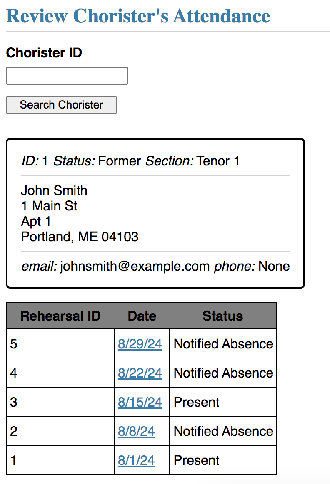

# ChoristerDB

## Getting Started
First - initialize the database:

```flask --app chorister_db init-db```

Second - run the app:

```flask --app chorister_db run --debug```

Then, navigate to 127.0.0.1/auth/login and use the username "admin" and the password "password"

This takes you to a homepage, with different sections of links, depending on your permissions. Note that at any point, you can click "ChoristerDB" at the top of the page to navigate back to the homepage.

## Database Administration

## Chorister Administration
### Viewing Members
The "View All Members" link takes you to page which displays all the members of the choir, as well as demographic and contact details.
Once on the Choir Members page, click on the chorister's Chorister ID to make changes to that chorister's details.

### Adding New Members
The "Add a New Member" link opens a form that allows you to enter in a new chorister's details. Note that fields marked with a red asterisk are mandatory. Once all details are entered, click "Add New Chorister" at the bottom, and you will be redirected to the list of all choristers, with the newest chorister added to the list.

## Attendance and Rehearsals
### Viewing Rehearsals
The "View All Rehearsals" link takes you to a page with the list of all rehearsals.
Once on the Rehearsals page, click on a rehearsal's date to view the attendance of that rehearsal.
To record a chorister's attendance for a particular rehearsal, simply type in the Chorister's ID, and select their attendance status (Present, Absent etc.), and click "Add".

Click on "Take Attendance" next to a rehearsal to take attendance for a particular voice section. After selecting the section, the list of members of that section will be displayed. Choose the appropriate attendance status for each member of the voice section and click "Submit Attendance".


### Adding New Rehearsals
The "Add a New Rehearsal" link (also present in the Rehearsals page) directs you to a page where you can enter the date of the new rehearsal. Click "Add New Rehearsal" and you will be directed to the list of all rehearsals, with the new rehearsal added.


### Reviewing a Chorister's Attendance
The "View a chorister's attendance" link allows you to search a chorister by ID. When you click "Search chorister", the chorister's information is displayed, as well as a record of the chorister's attendance. Such as seen below:

Click on the date for a rehearsal to navigate to the list of attendees of that rehearsal.

## Treasurer
### Making Payments
The "Add a Payment" link allows you to make a payment associated with a choir member. Enter the chorister's ID, the payment method (cash, venmo etc.) and the amount, and click "Add Payment".


### Reviewing a Chorister's Payments
The "Review a Chorister's Payments" link allows you to search by Chorister ID and view the Chorister's payment history.

Click on a Payment Id to view or edit which months that payment is assigned to. You may assign more months to a payment, or unassign previously assigned months from a payment.


### Reviewing a month's payments
The "Review a Month" link allows you to enter a month and year, and view all payments associated with that particular month.


## ER Diagram
This is the Entity-Relationship Diagram of the database we used.
